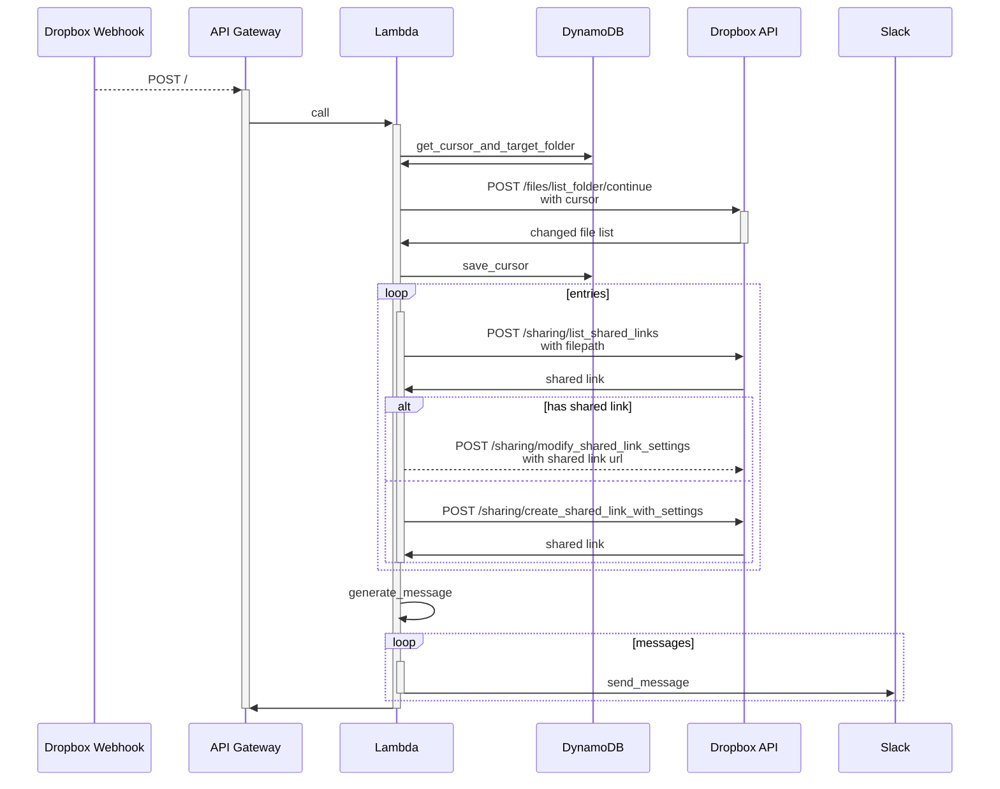

# Sequence

## Notification sequence.

```mermaid
sequenceDiagram
    participant dbx as Dropbox Webhook
    participant api as API Gateway
    participant lambda as Lambda
    participant db as DynamoDB
    participant dbxapi as Dropbox API
    participant slack as Slack

    dbx -->>+ api: POST /

    api ->>+ lambda: call

    lambda ->> db: get_cursor_and_target_folder
    db ->> lambda: 

    lambda ->>+ dbxapi: POST /files/list_folder/continue<br>with cursor
    dbxapi ->>- lambda: changed file list

    lambda ->> db: save_cursor

    loop entries
    activate lambda
        lambda ->> dbxapi: POST /sharing/list_shared_links<br>with filepath
        dbxapi ->> lambda: shared link
        alt has shared link
            lambda -->> dbxapi: POST /sharing/modify_shared_link_settings<br>with shared link url
        else
            lambda ->> dbxapi: POST /sharing/create_shared_link_with_settings
            dbxapi ->> lambda: shared link
        end
    deactivate lambda
    end

    lambda ->> lambda: generate_message
    loop messages
    activate lambda
        lambda ->> slack: send_message
    deactivate lambda
    end

    lambda ->>- api: 

    deactivate api
```
